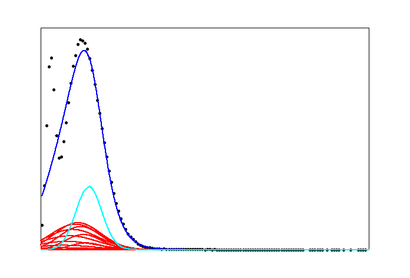

# Root-PMT-Fit-With-Machine-Learning
A collection of python code (with MySQL) to classify the outputs of a powerful fitting 
algorithm as either "good fit" or "bad fit" to the data.

This project gets its dataset by using Cern Root C++ program suite for very rigorous 
mathematical fitting. In this repository, I only include the results. To see how these 
results were generated, check out another repository of mine 
[here](https://github.com/bradylowe/Low-Light-PMT-Data-Root-Fit). 

*Dependencies:*
 - jupyter (for executing python notebooks)
 - pillow, scipy, matplotlib (for images) 
 - numpy, tensorflow, Keras (for neural net math)
 - IPython (for saving models)

*Quick start:*
 - Simply execute the following line of code:
    * jupyter notebook fit_pmt_conv_no_sql.ipynb

---

Example good and bad fits 

---
---

## Summary of files and directories

### *python notebooks (.ipynb):*
 - fit_pmt_conv_basic.ipynb
    * This notebook is the most basic convolution neural net example.
    * Within this notebook, we can load our data, define a convolutional model, train the model, and do a little evaluation. 
    * We can also save models or load models.
 - fit_pmt_conv.ipynb
    * This notebook trains two identical conv nets in parallel and then combines their outputs at the end to make predictions based on both of their opinions.
    * This notebook also takes into account all of the input and output parameters of the fitting algorithm. 
    * These extra parameters are activated and appended to the activations at the same time the two conv nets are merged.
 - fit_pmt_conv_no_sql.ipynb
    * This notebook is identical to the fit_pmt_conv notebook above except that it uses no sql database.
    * To replace the database, we must read the info in from the database on a computer with mysql installed and write the info to the no_sql_params.txt file.
    * The run_params table info is printed in one line followed by the fit_results table params in the next line
 - fit_pmt_dense_params.ipynb
    * This notebook doesn't use images at all.
    * This notebook only uses the inputs and outputs to the fitting algorithm to make predictions.
    * This notebook trains very quickly but doesn't do that well.

### *nn_utils.py:*
 - This file contains all the custom functions necessary to use implement machine learning on our data set such as:
    * get_printable_image(array) for printing our images with matplotlib
    * change_label(id) for changing mislabeled images
    * round(num) for rounding numbers to nearest integer
    * load_images_from_file(m, im_dir, log, list) for loading convolution dataset
    * load_images_from_scratch(m, im_dir, log, list) for loading convolution dataset
    * load_fit_inputs() for loading the input fit parameters from the sql database
    * load_fit_outputs() for loading the output fit parameters from the sql database
    * make_image_from_numbers(parameters, histogram) for creating images from data

### *trained:*
 - This directory stores trained neural networks.
 - The .h5 files contain the weights.
 - The .json files contain the definition of the network architecture.

### *histograms:*
 - This directory houses a collection of text files with numbers in them.
 - The numbers in these files define our dataset; each file represent a histogram with 4095 bins.
 - The files list the number of leading and trainling zeros, then it lists all the entries in between the leading/trailing zeros.
 - By reconstructing the 4095-dimensional vector, we will have a list of ordered pairs that define out data. 
 - The error on each data point is assumed to be the square root of the value of the data point.
 - These files allow for the construction of png images.

### *gaindb.sql:*
 - This file is a complete backup of the gaindb database.
 - The gaindb database stores two tables: run_params and fit_results.
 - The run_params table stores experimental run parameters such as:
    * high voltage setting
    * which PMT was used
    * which ADC channel was the signal taken on
    * what what the light level
    * which filters were used
    * etc (use "DESCRIBE run_params;" to see the complete list in sql)
 - The fit_results table stores required fit inputs and all fit outputs such as:
    * initial guesses of all 9 parameters
    * min and max bounds of all 9 parameters
    * the output parameters selected by the fitting algorithm
    * the calculated error on the predicted parameters from the fit
    * chi-squared per degree of freedom
 - Once mysql is installed, you should be able to (from the command line) run:
    * mysql -u user -p gaindb < gaindb.sql
 - This command should create the gaindb database and populate it with values. (If this is not the case, you must first define the gaindb database on your system and give your user all permissions over the database, described [here](https://dev.mysql.com/doc/refman/8.0/en/creating-database.html)).

### *images:*
 - This directory houses the images created for training and testing.
 - The development images have run_id % 10 == 0
 - The testing images have run_id % 10 == 1
 - The training images have run_id % 10 > 1
 - All images are PNG type
 - PNGs can be either log-scale or linear-scale

